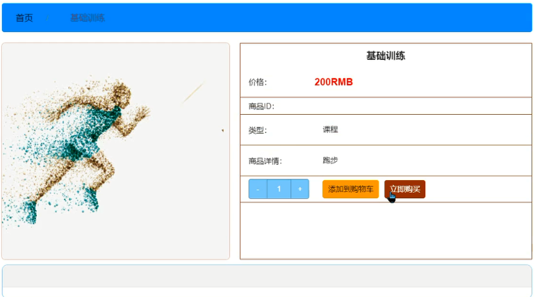

[索要源码请点我](http://mp.weixin.qq.com/mp/appmsgalbum?__biz=MzkwMDY3MTY0Nw==&action=getalbum&album_id=3423120253595582465&scene=173&subscene=&sessionid=svr_dbd799d91a1&enterid=1713666527&from_msgid=&from_itemidx=&count=3&nolastread=1#wechat_redirect)

【需要源码和论文：QQ联系 979748385 QQ群 601569450】

推荐使用：谷歌浏览器 

后台地址
http://localhost:8080/springbootxs5o6/admin/dist/index.html

管理员  abo 密码 abo

前台地址：http://localhost:8080/springbootxs5o6/front/index.html

在src\main\resources\application.yml中编辑
											
	 url: jdbc:mysql://127.0.0.1:3306/springbootxs5o6?useUnicode=true&characterEncoding=utf-8&useJDBCCompliantTimezoneShift=true&useLegacyDatetimeCode=false&serverTimezone=UTC
	    username: root
	    password: 123456 （数据库密码）

